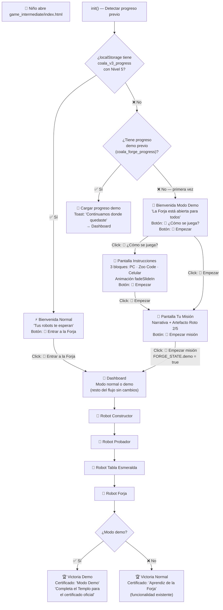

# Design — Forja Intermedia: Bug Fix + Guía Didáctica

## Metadata

| Campo | Valor |
|---|---|
| **Feature ID** | FEAT-002 |
| **Slug** | `coala-forja-guide-fix` |
| **Pipeline Mode** | PROTOTIPO 🚀 |
| **Stack** | HTML5 + CSS3 + Vanilla JS, cero dependencias |
| **Archivo principal** | [`game_intermediate/index.html`](../../game_intermediate/index.html:1) (modificar, 644 líneas) |
| **Parte** | 1 de 3 — Mejora de flujo de entrada y guía didáctica |
| **Fecha** | 2026-06-17 |

---

## Diagrama de Flujo — Entrada a la Forja (nuevo)



[PROTO: diagrama de flujo simplificado. El flujo del Dashboard hacia adelante (Robots → Victoria) no se modifica. Solo se agrega el preámbulo de bienvenida + instrucciones + misión para el camino demo. En versión beta/producción se añadirían transiciones más elaboradas y analytics de onboarding.]

---

## Estructura de Pantallas

### Pantallas existentes (7 — sin modificar estructura)

| Screen ID | Nombre | ¿Se modifica? |
|---|---|---|
| `screenWelcome` | Bienvenida | ✅ Contenido HTML + lógica JS |
| `screenDashboard` | Dashboard | ❌ Sin cambios estructurales |
| `screenRobotConstructor` | Robot Constructor | ❌ Sin cambios |
| `screenRobotTester` | Robot Probador | ❌ Sin cambios |
| `screenRobotTablet` | Robot Tabla Esmeralda | ❌ Sin cambios |
| `screenRobotForge` | Robot Forja | ❌ Sin cambios |
| `screenVictory` | Victoria | ✅ Texto certificado (condicional demo) |

### Pantallas nuevas (2)

| Screen ID | Nombre | Posición en flujo |
|---|---|---|
| `screenInstructions` | ¿Cómo se juega? | Después de Bienvenida (modo demo) |
| `screenMission` | Tu misión | Después de Instrucciones o directo desde Bienvenida |

---

## Modificaciones al State Machine

### [`FORGE_STATE`](../../game_intermediate/index.html:306) — Campos nuevos

```javascript
let FORGE_STATE = {
  // ... campos existentes sin modificar ...
  screen: 'welcome',
  progress: 0,
  robots: { constructor:'locked', tester:'locked', tablet:'locked', forge:'locked' },
  artifact: { screen1:true, screen2:true, screen3:false, screen4:false, screen5:false },
  templeLevel5Complete: false,
  sessionStart: Date.now(),
  completionTime: null,
  score: 0,

  // ===== NUEVOS v7.2 — guía didáctica =====
  demo: false,        // true = modo demo sin progreso del Templo
  firstVisit: true     // true = primera visita (mostrar instrucciones)
};
```

### [`saveState()`](../../game_intermediate/index.html:330) — Extender datos persistidos

```javascript
function saveState(){
  try{
    const data = {
      v: 1,
      progress: FORGE_STATE.progress,
      robots: FORGE_STATE.robots,
      artifact: FORGE_STATE.artifact,
      score: FORGE_STATE.score,
      demo: FORGE_STATE.demo,          // NUEVO
      checksum: simpleChecksum({...}),
      savedAt: Date.now()
    };
    localStorage.setItem(STORAGE_KEY, JSON.stringify(data));
    return true;
  }catch(e){ showToast('⚠️ Tu progreso no se guardará entre sesiones.'); return false; }
}
```

### [`loadState()`](../../game_intermediate/index.html:337) — Restaurar flag demo

```javascript
function loadState(){
  try{
    const raw = localStorage.getItem(STORAGE_KEY);
    if(!raw) return false;
    const data = JSON.parse(raw);
    if(data.v !== 1) return false;
    FORGE_STATE.progress = data.progress || 0;
    FORGE_STATE.robots = data.robots || {...};
    FORGE_STATE.artifact = data.artifact || {...};
    FORGE_STATE.score = data.score || 0;
    FORGE_STATE.demo = data.demo || false;     // NUEVO
    FORGE_STATE.firstVisit = false;             // NUEVO
    return true;
  }catch(e){ localStorage.removeItem(STORAGE_KEY); showToast('Thot olvidó tu progreso. ¿Empezamos de nuevo?'); return false; }
}
```

---

## Funciones Modificadas

### `goToDashboard()` — Refactor completo

**Antes** (línea 380): bloquea si `!FORGE_STATE.templeLevel5Complete`.

**Después:**

```javascript
function goToDashboard(){
  playClick();
  // Path A: Templo Nivel 5 completado → acceso directo
  if(FORGE_STATE.templeLevel5Complete){
    switchScreen('screenDashboard');
    return;
  }
  
  // Path B: Sin Templo → modo demo
  FORGE_STATE.demo = true;
  
  // Primera visita → mostrar instrucciones y misión
  if(FORGE_STATE.firstVisit){
    FORGE_STATE.firstVisit = false;
    switchScreen('screenMission');
    showToast('🎮 Modo demo: jugá sin límites. Completá el Templo para el certificado oficial.', 4000);
    return;
  }
  
  // Visita posterior → ir directo al Dashboard
  switchScreen('screenDashboard');
}
```

### `init()` — Nueva lógica de bienvenida

**Antes** (línea 626): si no hay Templo Nivel 5, reemplaza toda la bienvenida con enlace al Templo.

**Después:**

```javascript
function init(){
  FORGE_STATE.templeLevel5Complete = checkTempleLevel5();
  const saved = loadState();
  
  if(saved){
    showToast('¡Bienvenido de vuelta! Continuamos donde quedaste.');
    if(FORGE_STATE.progress > 0){
      // Ya tiene progreso → ir directo al Dashboard
      renderDashboard();
      switchScreen('screenDashboard');
      return;
    }
  }
  
  // Renderizar bienvenida contextual
  renderWelcome();
}
```

### `renderWelcome()` — NUEVA función

Renderiza el contenido de [`#screenWelcome`](../../game_intermediate/index.html:129) según el contexto:

```javascript
function renderWelcome(){
  const welcomeText = document.getElementById('welcomeText');
  const welcomeActions = document.getElementById('welcomeActions');
  
  if(FORGE_STATE.templeLevel5Complete){
    // Mensaje normal (existente, preservado)
    welcomeText.innerHTML = 'Este juego fue <strong>construido por robots</strong>, pero algo salió mal. Solo <strong>2 de 5 pantallas</strong> funcionan. Necesito tu ayuda para repararlo.';
    welcomeActions.innerHTML = '<button class="btn btn-primary" onclick="goToDashboard()">🔧 Entrar a la Forja</button>';
  } else {
    // Mensaje modo demo
    welcomeText.innerHTML = '¡Hola! La <strong>Forja de Thot</strong> está abierta para todos.<br>Los robots están dormidos 💤 ¿Listo para despertarlos?';
    welcomeActions.innerHTML = `
      <button class="btn btn-primary" onclick="goToDashboard()">🚀 Empezar</button>
      <button class="btn btn-secondary" onclick="switchScreen(\'screenInstructions\')">📖 ¿Cómo se juega?</button>
    `;
  }
}
```

### `showCertificate()` — Texto condicional demo

```javascript
function showCertificate(){
  const certView = document.getElementById('certificateView');
  certView.style.display = 'block';
  document.getElementById('certDate').textContent = new Date().toLocaleDateString('es-CL');
  
  if(FORGE_STATE.demo){
    // Ajustar texto del certificado para modo demo
    const h3 = certView.querySelector('h3');
    if(h3) h3.textContent = '🎮 Certificado — Modo Demo';
    const p = certView.querySelectorAll('p')[2]; // "Se otorga a:"
    if(p) p.nextElementSibling.textContent = 'Explorador de la Forja';
  }
}
```

### `resetGame()` — Preservar templeLevel5Complete

Ya lo hace (línea 619), solo verificar que no borre `demo` incorrectamente. Mantener `demo: false` en reset.

---

## Estructura HTML — Nuevas Pantallas

### `screenInstructions` — ¿Cómo se juega?

```html
<div class="screen" id="screenInstructions">
  <div class="card welcome-content">
    <h2 class="welcome-title">📖 ¿Cómo se juega?</h2>
    <p style="color:var(--sand);font-size:0.85rem;margin-bottom:0.5rem">
      Necesitás 2 cosas para jugar (y 1 opcional):
    </p>
    
    <div class="instruction-blocks">
      <div class="instruction-block" style="animation-delay:0.1s">
        <span class="instruction-icon">🖥️</span>
        <h3>Tu PC</h3>
        <p>Abrí <strong>VS Code</strong> y cargá la carpeta<br><span class="code-inline">game_intermediate/seed/</span></p>
      </div>
      
      <div class="instruction-block" style="animation-delay:0.2s">
        <span class="instruction-icon">🤖</span>
        <h3>Zoo Code</h3>
        <p>Usá los <strong>robots</strong> para reparar<br>el código del Artefacto Roto</p>
      </div>
      
      <div class="instruction-block" style="animation-delay:0.3s">
        <span class="instruction-icon">📱</span>
        <h3>Tu celu o tablet</h3>
        <p>Abrí esta misma página en tu<br>celular para ver el juego mientras codeás</p>
      </div>
    </div>
    
    <div style="display:flex;gap:0.5rem;flex-wrap:wrap;justify-content:center;margin-top:0.8rem">
      <button class="btn btn-primary" onclick="goToDashboard()">🚀 Empezar</button>
      <button class="btn btn-secondary" onclick="switchScreen('screenWelcome')">⬅️ Volver</button>
    </div>
  </div>
</div>
```

### `screenMission` — Tu misión

```html
<div class="screen" id="screenMission">
  <div class="card welcome-content">
    <h2 class="welcome-title">🎯 Tu misión</h2>
    
    <div style="font-size:3rem;margin:0.3rem 0">💤</div>
    <p style="color:var(--sand);font-size:0.85rem;max-width:420px;margin:0 auto;line-height:1.5">
      Los <strong>robots están dormidos</strong>. ¡Despertalos uno por uno!<br>
      Cada robot te enseña algo nuevo.<br>
      Repará las <strong>5 pantallas del Artefacto</strong>.
    </p>
    
    <div class="artifact-grid" id="missionArtifactGrid" style="max-width:340px;margin:0.5rem auto"></div>
    <p style="font-size:0.7rem;color:var(--sand);opacity:0.6">2 de 5 pantallas funcionan · 3 necesitan reparación</p>
    
    <div style="margin-top:0.6rem">
      <button class="btn btn-primary" onclick="goToDashboard()">🚀 Empezar misión</button>
      <button class="btn btn-secondary" onclick="switchScreen('screenWelcome')" style="margin-left:0.5rem">⬅️ Volver</button>
    </div>
  </div>
</div>
```

---

## CSS — Nuevas Reglas

### Bloques de instrucciones

```css
/* Instruction blocks — mobile-first (columna) */
.instruction-blocks {
  display: flex;
  flex-direction: column;
  gap: 0.6rem;
  margin: 0.4rem 0;
}

.instruction-block {
  display: flex;
  flex-direction: column;
  align-items: center;
  gap: 0.3rem;
  padding: 0.8rem 0.6rem;
  background: rgba(255,255,255,0.03);
  border: 1px solid rgba(212,168,67,0.12);
  border-radius: var(--radius);
  text-align: center;
  animation: fadeSlideIn 0.4s ease both;
}

.instruction-icon {
  font-size: 2.5rem;   /* ≥2.5rem requerido por AC */
}

.instruction-block h3 {
  font-family: var(--font-title);
  font-size: 0.9rem;
  color: var(--gold-bright);
  margin: 0;
}

.instruction-block p {
  font-size: 0.75rem;
  color: var(--sand);
  opacity: 0.85;
  margin: 0;
  line-height: 1.4;
}

/* Desktop: 3 columnas */
@media (min-width: 600px) {
  .instruction-blocks {
    flex-direction: row;
  }
  .instruction-block {
    flex: 1;
  }
}
```

### Mejora de bienvenida — glow y botones grandes

```css
/* Icono animado mejorado */
.thot-icon {
  font-size: 4rem;
  animation: thotGlow 2.5s infinite;
}
@keyframes thotGlow {
  50% { filter: drop-shadow(0 0 20px rgba(244,197,66,0.55)); }
}

/* Título con glow dorado */
.welcome-title {
  font-family: var(--font-title);
  font-size: clamp(1.2rem, 5vw, 1.6rem);
  color: var(--gold-bright);
  text-shadow: 0 0 14px rgba(244,197,66,0.3);  /* NUEVO: glow */
}

/* Botón primario agrandado */
.btn-primary {
  padding: 0.8rem 2rem;       /* NUEVO: aumentado desde 0.65rem 1.4rem */
  font-size: 1.1rem;           /* NUEVO: aumentado desde 0.9rem */
}
```

---

## Modificaciones a Pantallas Existentes

### `screenWelcome` — HTML a modificar

**Antes** (líneas 129-141):
```html
<div class="screen active" id="screenWelcome">
  <div class="card welcome-content">
    <div class="thot-icon">🦉</div>
    <h2 class="welcome-title">Bienvenido, aprendiz</h2>
    <p class="welcome-text" id="welcomeText">
      Este juego fue <strong>construido por robots</strong>, pero algo salió mal...
    </p>
    <div id="welcomeActions">
      <button class="btn btn-primary" onclick="goToDashboard()">🔧 Entrar a la Forja</button>
    </div>
  </div>
</div>
```

**Después** (cambios mínimos):
```html
<div class="screen active" id="screenWelcome">
  <div class="card welcome-content">
    <div class="thot-icon">🦉</div>
    <h2 class="welcome-title" id="welcomeTitle">Bienvenido, aprendiz</h2>
    <p class="welcome-text" id="welcomeText">
      <!-- Contenido dinámico vía renderWelcome() -->
    </p>
    <div id="welcomeActions">
      <!-- Contenido dinámico vía renderWelcome() -->
    </div>
  </div>
</div>
```

### `screenVictory` — Certificado condicional

El [`#certificateView`](../../game_intermediate/index.html:282) ya tiene la estructura. Solo se modifica [`showCertificate()`](../../game_intermediate/index.html:607) para detectar `FORGE_STATE.demo` y cambiar el texto.

---

## Resumen de Cambios en el Archivo

| Sección | Tipo de cambio | Líneas aproximadas |
|---|---|---|
| `FORGE_STATE` | Agregar 2 campos | +3 líneas |
| `saveState()` | Agregar `demo` al objeto | +1 línea |
| `loadState()` | Restaurar `demo` y `firstVisit` | +2 líneas |
| `goToDashboard()` | Refactor completo (~15 líneas) | reemplazo |
| `init()` | Refactor (~10 líneas) | reemplazo |
| `renderWelcome()` | Nueva función (~20 líneas) | +20 líneas |
| `showCertificate()` | Condicional demo (~8 líneas) | modificación |
| CSS | Nuevos bloques `.instruction-blocks` (~35 líneas) | +35 líneas |
| CSS | Ajuste `.btn-primary` padding/font-size | modificación |
| CSS | Ajuste `.welcome-title` text-shadow | modificación |
| HTML `#screenWelcome` | Agregar `id="welcomeTitle"` | modificación |
| HTML `#screenInstructions` | Nueva pantalla (~30 líneas) | +30 líneas |
| HTML `#screenMission` | Nueva pantalla (~25 líneas) | +25 líneas |

**Total estimado:** ~130 líneas nuevas/modificadas sobre 644 existentes (~20% de cambio).

---

[PROTO: diseño simplificado. Sin interfaces TypeScript formales. Diagrama Mermaid básico de flujo. Las pantallas nuevas usan las mismas clases CSS y animaciones del HUB existente. En versión beta se añadirían interfaces formales para `ForgeState` y tests unitarios con Jest.]

**STATUS: DRAFT ✓**
**OUTPUT_FILE:** `docs/specs/coala-forja-guide-fix/design.md`
