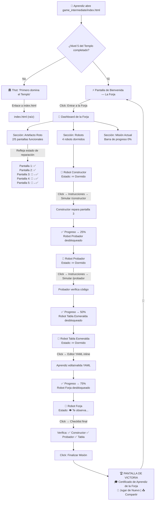

# Design — COALA: La Forja de la Tabla Esmeralda

## Metadata

| Campo | Valor |
|---|---|
| **Feature ID** | FEAT-001 |
| **Slug** | `coala-forja-intermediate` |
| **Pipeline Mode** | PROTOTIPO 🚀 |
| **Stack** | HTML5 + CSS3 + Vanilla JS, cero dependencias |
| **Archivo principal** | [`game_intermediate/index.html`](game_intermediate/index.html) |
| **Fecha** | 2026-06-17 |

---

## Diagrama de Flujo — HUB → Robots → Artefacto



[PROTO: diagrama de flujo simplificado. Las interacciones con Zoo Code/VS Code son simuladas en prototipo mediante botones "Ya lo hice" y transiciones de estado. En versión beta/producción se añadiría polling real de archivos.]

---

## Estructura de Archivos

```
raíz del repo (index.html)          ← NO modificar
│
├── game_intermediate/               ← TODO el feature aquí
│   ├── index.html                   ← HUB principal (single-file autocontenido)
│   ├── seed/
│   │   └── index.html               ← Artefacto Roto (juego incompleto 2/5)
│   └── assets/                      ← (opcional en prototipo: sprites inline en CSS)
│
├── custom_modes_v6.0_edu.yaml       ← Extender con 4 robots de la Forja
│
└── docs/
    └── specs/
        └── coala-forja-intermediate/
            ├── requirements.md      ← este documento
            ├── design.md            ← este documento
            └── tasks.md             ← tareas de implementación
```

**Principio:** Single-file HTML autocontenido por nivel. CSS en `<style>`, JS en `<script>`, sin archivos externos. Íconos vía emoji nativo + Unicode (☥, 𓂀, ◈). Sin fuentes de Google, sin CDN.

---

## Diseño Visual

### Paleta de Colores (herencia del Templo de Thot)

| Variable CSS | Valor | Uso |
|---|---|---|
| `--gold` | `#D4A843` | Bordes, iconos secundarios, texto dorado tenue |
| `--gold-bright` | `#F4C542` | Títulos, botones primarios, acentos, brillos |
| `--sand` | `#E8D5A3` | Texto body, descripciones |
| `--sand-dark` | `#C2A870` | Texto secundario, iconos inactivos |
| `--nile` | `#1A3A5C` | Fondos de secciones, paneles |
| `--night` | `#1A1A2E` | Fondo principal |
| `--night-light` | `#252545` | Cards, toasts |
| `--success` | `#2ECC71` | Checks, progreso completado, confirmaciones |
| `--error` | `#E74C3C` | Errores, advertencias, YAML inválido |
| `--text-light` | `#F5E6C8` | Texto principal sobre fondos oscuros |

### Tipografías (system fonts, sin dependencias externas)

| Variable CSS | Stack | Uso |
|---|---|---|
| `--font-title` | `Georgia, 'Times New Roman', serif` | Títulos, mensajes de Thot, paneles de robot |
| `--font-body` | `'Segoe UI', 'Helvetica Neue', Arial, sans-serif` | Texto general, botones, descripciones |
| `--font-mono` | `'Consolas', 'Courier New', monospace` | Código YAML, comandos de terminal |

### Tamaños Responsive

| Breakpoint | Comportamiento |
|---|---|
| **≥320px** (mínimo) | Layout single-column, cards full-width, texto ≥14px |
| **320px–480px** | Padding reducido (0.4rem), botones compactos, fuente 0.62–0.85rem |
| **480px–768px** | Layout cómodo, cards con padding estándar |
| **≥768px** | Max-width 720px centrado (igual que `index.html` raíz) |

### Sistema de Componentes Visuales

| Componente | Clase CSS (referencia) | Descripción |
|---|---|---|
| **App Container** | `.app-container` | Contenedor principal, max-width 720px, centrado, flex column |
| **Game Header** | `.game-header` | Logo + título + subtítulo, animación bounce en logo |
| **Screen** | `.screen` | Pantallas intercambiables con fadeSlideIn (display none/active) |
| **Card** | `.card` | Fondo semitransparente, borde dorado, backdrop-filter blur |
| **Button Primary** | `.btn .btn-primary` | Gradiente dorado, sombra, hover levanta 2px |
| **Button Secondary** | `.btn .btn-secondary` | Borde dorado, fondo transparente, hover sutil |
| **Progress Bar** | `.progress-bar-wrap` / `.progress-step` | 4 segmentos horizontales, animación pulse en activo, dorado en done |
| **Robot Card** | `.robot-card` | Card con emoji grande, nombre, estado (dormido/activo/completado), glow animation al activarse |
| **Artefacto Preview** | `.artifact-preview` | Grid 5 columnas (responsive), cada celda muestra miniatura de pantalla con overlay gris/verde |
| **Dashboard Grid** | `.dashboard-grid` | Grid 2-columnas (escritorio) / 1-columna (móvil) para robots + artefacto |
| **YAML Editor** | `.yaml-editor` | Fondo oscuro (#0A0A0D), sintaxis resaltada con spans coloreados, borde dorado |
| **YAML Validator** | `.yaml-validator` | Línea de error en rojo con tooltip, mensaje "⚠️ Falta ':' después de 'slug'" |
| **Checklist** | `.checklist` | Lista de items con iconos ✅/⬜, item faltante parpadea en naranja |
| **Toast** | `.toast` | Notificación flotante inferior centrada, slide-up, auto-dismiss |
| **Confetti** | `.confetti` | Partículas CSS animadas (pseudo-elementos + keyframes) para celebración |
| **Certificado** | `.certificate` | Pantalla especial con borde dorado decorativo, fondo pergamino, firma de Thot |

### Glyphs y Ambientación

- Fondo con glyphs flotantes (☥, 𓂀, ◈) animados con `floatGlyph` keyframe (igual que [`index.html`](index.html:18)).
- Nuevos glyphs temáticos de la Forja: ⚙️ (engranaje), 🔧 (herramienta), 🔨 (martillo).
- Fondo con radial-gradient sobre `--night` para profundidad.

---

## Arquitectura JavaScript

### State Machine

```javascript
const FORGE_STATE = {
  // Pantalla actual
  screen: 'welcome',          // welcome | dashboard | robot-constructor | robot-tester | robot-tablet | robot-forge | victory

  // Progreso de misión
  progress: 0,                // 0 | 25 | 50 | 75 | 100

  // Estados de robots
  robots: {
    constructor: 'locked',    // locked | dormant | active | completed
    tester:       'locked',   // locked | dormant | active | completed
    tablet:       'locked',   // locked | dormant | active | completed
    forge:        'locked',   // locked | dormant | active | completed
  },

  // Artefacto Roto: qué pantallas están reparadas
  artifact: {
    screen1: true,            // Bienvenida — siempre funcional
    screen2: true,            // Nivel 1 — siempre funcional
    screen3: false,           // Nivel 2 — repara el Constructor
    screen4: false,           // Nivel 3 — repara el Probador
    screen5: false,           // Victoria — repara la Forja
  },

  // Requisito: ¿completó Nivel 5 del Templo?
  templeLevel5Complete: false, // chequeado de localStorage 'coala_v3_progress'

  // Timestamps
  sessionStart: null,
  completionTime: null,

  // Puntuación
  score: 0,
};
```

### Transiciones de Estado

```
welcome → (click "Entrar a la Forja") → dashboard

dashboard → (click Robot Constructor) → robot-constructor
robot-constructor → (completar simulación) → dashboard (progress=25, constructor=completed, tester=dormant)

dashboard → (click Robot Probador) → robot-tester
robot-tester → (completar simulación) → dashboard (progress=50, tester=completed, tablet=dormant)

dashboard → (click Robot Tabla Esmeralda) → robot-tablet
robot-tablet → (YAML válido + activar) → dashboard (progress=75, tablet=completed, forge=dormant)

dashboard → (click Robot Forja) → robot-forge
robot-forge → (checklist ✅ → Finalizar) → victory (progress=100)

victory → (Jugar de Nuevo) → welcome (reset)
```

### Módulos JS (todo en un solo `<script>`)

| Módulo | Responsabilidad |
|---|---|
| **`ForgeApp`** | Orquestador principal. Init, cambio de pantallas, coordinación de módulos. |
| **`ScreenManager`** | Muestra/oculta pantallas con animación `fadeSlideIn`. Gestiona `screen.active`. |
| **`ProgressManager`** | Actualiza barra de progreso visual. Dispara hitos (25/50/75/100%). Calcula score. |
| **`StorageAdapter`** | Wrapper de `localStorage` con fallback graceful. Clave: `coala_forge_progress`. Serializa/deserializa `FORGE_STATE`. |
| **`RobotManager`** | Controla estado de cada robot (locked/dormant/active/completed). Bloquea acceso a robots no desbloqueados. |
| **`ArtifactView`** | Renderiza vista previa del Artefacto Roto. Actualiza celdas al cambiar `FORGE_STATE.artifact`. |
| **`YamlValidator`** | Validación básica de YAML en tiempo real: detecta falta de `:`, claves requeridas (`customModes`, `slug`, `name`, `roleDefinition`), indentación inconsistente. |
| **`AudioWrapper`** | Wrapper de Web Audio API con fallback silencioso. Funciones: `playTone(freq, type, duration)`, `playCorrect()`, `playWrong()`, `playClick()`, `playVictory()`, `playForgeAmbient()`. |
| **`ToastNotify`** | Sistema de toasts: mensaje temporal con auto-dismiss. |
| **`ConfettiCelebration`** | Animación CSS de confeti al alcanzar 100%. |

### API de localStorage

```javascript
// Clave única para el nivel intermedio
const STORAGE_KEY = 'coala_forge_progress';

// Save
function saveForgeState(state) {
  try {
    const data = {
      v: 1,                           // versión del schema
      progress: state.progress,
      robots: state.robots,
      artifact: state.artifact,
      score: state.score,
      checksum: simpleChecksum(state), // anti-tampering básico
      savedAt: Date.now(),
    };
    localStorage.setItem(STORAGE_KEY, JSON.stringify(data));
    return true;
  } catch (e) {
    // localStorage bloqueado o lleno
    showToast('⚠️ Tu progreso no se guardará entre sesiones.');
    return false;
  }
}

// Load
function loadForgeState() {
  try {
    const raw = localStorage.getItem(STORAGE_KEY);
    if (!raw) return null;
    const data = JSON.parse(raw);
    // Validar checksum
    if (data.v !== 1) return null;
    return data;
  } catch (e) {
    // JSON corrupto → limpiar y reiniciar
    localStorage.removeItem(STORAGE_KEY);
    showToast('Thot olvidó tu progreso. ¿Empezamos de nuevo?');
    return null;
  }
}
```

### Detección de Nivel 5 Completado

```javascript
function checkTempleLevel5() {
  try {
    const raw = localStorage.getItem('coala_v3_progress');
    if (!raw) return false;
    const data = JSON.parse(raw);
    // Nivel 5 completado si unlocked incluye 5
    return data.unlocked && data.unlocked.includes(5);
  } catch (e) {
    return false;
  }
}
```

---

## Diseño del Artefacto Roto (`seed/index.html`)

### Estructura de 5 Pantallas

| # | Pantalla | Estado inicial | Quién la repara |
|---|---|---|---|
| 1 | Bienvenida | ✅ Funcional | — (siempre funciona) |
| 2 | Nivel 1 — El Desafío | ✅ Funcional | — (siempre funciona) |
| 3 | Nivel 2 — El Enigma | 🔧 En reparación (gris) | Robot Constructor |
| 4 | Nivel 3 — La Prueba | 🔧 En reparación (gris) | Robot Probador |
| 5 | Victoria | 🔧 En reparación (gris) | Robot Forja |

### Diseño de Pantalla Rota

```html
<div class="screen broken" data-screen="3">
  <div class="broken-overlay">
    <span class="broken-icon">🔧</span>
    <p class="broken-text">En reparación...</p>
    <p class="broken-hint">Completa la misión del Robot Constructor para desbloquear</p>
  </div>
  <!-- Contenido real del juego debajo, invisible/gris -->
</div>
```

### Transición de Reparación

Cuando una pantalla se repara:
1. Overlay gris se desvanece (opacity 1 → 0 en 1s).
2. Contenido real aparece con brillo dorado (`filter: brightness(1.5)` → `brightness(1)`).
3. Emoji 🔧 cambia a ✅.
4. Sonido de engranaje (tone ascendente).

---

## Mobile-First & Touch-First

| Principio | Implementación |
|---|---|
| **No hover dependency** | Todos los interactivos usan `click`/`touchstart`. Estilos `:hover` son solo progressive enhancement. |
| **Touch targets ≥44px** | Botones y áreas clickeables mínimo 44×44px (WCAG 2.1). |
| **Viewport** | `<meta name="viewport" content="width=device-width, initial-scale=1.0">` |
| **Font size mínimo** | 14px en mobile, escalando con `clamp()`. |
| **Scroll suave** | `scroll-behavior: smooth` en `html`. |
| **`prefers-reduced-motion`** | `@media (prefers-reduced-motion: reduce) { *,*::before,*::after { animation-duration: 0.01ms !important } }` |

---

## `<noscript>` Obligatorio

```html
<noscript>
  <div style="
    display:flex;align-items:center;justify-content:center;
    min-height:100vh;background:#1A1A2E;color:#E8D5A3;
    font-family:Georgia,serif;text-align:center;padding:2rem;
  ">
    <div>
      <div style="font-size:4rem">🔧</div>
      <h1 style="color:#F4C542;margin:1rem 0">La Forja necesita JavaScript</h1>
      <p style="font-size:1.1rem;line-height:1.6;max-width:400px;margin:0 auto">
        La Forja de Thot es un taller interactivo que usa JavaScript 
        para darle vida a los robots y al Artefacto.
      </p>
      <p style="margin-top:1rem;opacity:0.7">
        🐨 Pídele ayuda a un adulto para habilitar JavaScript en el navegador.
      </p>
    </div>
  </div>
</noscript>
```

---

## Notas de Prototipo

[PROTO: simplificado — diagrama de flujo sin ramas de error detalladas. Sin interfaces formales TypeScript/Dart. Sin arquitectura de polling real de archivos; las interacciones con Zoo Code/VS Code se simulan con botones "Ya lo hice". El YAML validator es básico (sintaxis, no semántica). Sin sistema de i18n (solo español). Sin service worker ni PWA.]

---

**STATUS: COMPLETE**  
**NEXT: Generar tasks.md**
