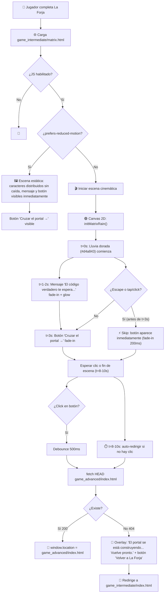

# Design — COALA: El Portal del Código

## Metadata

| Campo | Valor |
|---|---|
| **Feature ID** | FEAT-003 |
| **Slug** | `coala-forja-matrix` |
| **Pipeline Mode** | PROTOTIPO 🚀 |
| **Stack** | HTML5 + CSS3 + Vanilla JS (Canvas 2D), cero dependencias |
| **Archivo principal** | [`game_intermediate/matrix.html`](game_intermediate/matrix.html) |
| **Fecha** | 2026-06-17 |

---

## Diagrama de Flujo — Escena Matrix



[PROTO: diagrama de flujo simplificado. Sin manejo de edge cases de red (403, timeout). Sin animación de salida/transición al redirigir. La detección de 404 usa `fetch` HEAD básico con fallback a `setTimeout`. En versión beta se añadiría transición de salida con fade-out del Canvas.]

---

## Estructura de Archivos

```
game_intermediate/
├── index.html                       ← La Forja HUB (NO modificar)
├── seed/
│   └── index.html                   ← Artefacto Roto (NO modificar)
└── matrix.html                      ← 🆕 El Portal del Código (single-file)
    ├── <style>                      ← CSS inline: custom properties, layout, animaciones
    ├── <canvas id="matrixCanvas">   ← Canvas 2D para la lluvia de caracteres
    ├── <div id="messageOverlay">    ← Mensaje "El código verdadero te espera..."
    ├── <button id="btnPortal">      ← Botón "Cruzar el portal →"
    ├── <div id="fallbackOverlay">   ← Overlay de portal no disponible
    └── <script>                     ← JS inline: MatrixRain, AudioWrapper, state machine
```

**Principio:** Single-file HTML autocontenido. CSS en `<style>`, JS en `<script>`, sin archivos externos. Sin CDN, sin fuentes de Google, sin frameworks.

---

## Diseño Visual

### Paleta de Colores

| Variable CSS | Valor | Uso |
|---|---|---|
| `--night` | `#0a0a0f` | Fondo principal del body y Canvas |
| `--gold` | `#d4a843` | Caracteres iniciales de lluvia, glow del mensaje, borde del botón |
| `--matrix-green` | `#00ff41` | Caracteres finales de lluvia, hover del botón |
| `--gold-glow` | `rgba(212, 168, 67, 0.6)` | `text-shadow` del mensaje central |
| `--green-glow` | `rgba(0, 255, 65, 0.5)` | `text-shadow` hover del botón |
| `--overlay-bg` | `rgba(10, 10, 15, 0.92)` | Fondo del overlay de fallback |

### Transición de Color — Lluvia

```
t=0.0s ───── t=1.0s ───── t=2.0s ───── t=3.0s ───── t=4.0s ───── t=5.0s
 100% gold   80% gold    50% gold    30% gold    10% gold     0% gold
  0% green   20% green   50% green   70% green   90% green   100% green
```

La interpolación no es lineal: usa `easeInOutQuad` para que el cambio sea más notable en el medio del rango (t=2-3s). Cada nuevo carácter que se genera recibe un color interpolado según `elapsedTime / TRANSITION_DURATION`.

### Timing de la Escena

| Evento | t (segundos) | Duración | Descripción |
|---|---|---|---|
| Inicio de lluvia | 0.0s | ∞ (loop) | Caracteres dorados empiezan a caer inmediatamente |
| Fade-in del mensaje | 1.0s → 2.0s | 1.0s | "El código verdadero te espera..." con `opacity 0→1` |
| Aparición del botón | 3.0s ± 500ms | 0.5s fade-in | "Cruzar el portal →" con `opacity 0→1` y `transform scale(0.9→1)` |
| Skip (Escape/tap) | < 3.0s | 0.2s fade-in | El botón aparece inmediatamente con fade-in rápido |
| Auto-redirect | 8.0s – 10.0s | instantáneo | Si no hay clic, redirige automáticamente |
| Total escena | ~8-10s | — | Puede acortarse a ~3s con skip |

### Tipografías (system fonts, sin dependencias externas)

| Variable CSS | Stack | Uso |
|---|---|---|
| `--font-matrix` | `'Courier New', 'Consolas', monospace` | Caracteres de lluvia Canvas, botón |
| `--font-message` | `Georgia, 'Times New Roman', serif` | Mensaje central "El código verdadero te espera..." |
| `--font-ui` | `'Segoe UI', 'Helvetica Neue', Arial, sans-serif` | Overlay de fallback, `<noscript>` |

### Tamaños Responsive

| Breakpoint | Comportamiento |
|---|---|
| **≥320px** (mínimo) | Canvas full-viewport. Mensaje `font-size: clamp(1.2rem, 4vw, 2.5rem)`. Botón min-width 80%. |
| **320px–480px** | Caracteres de lluvia `font-size: 12px–14px`. Columnas de lluvia: ~15-20. |
| **480px–768px** | Caracteres `font-size: 14px–16px`. Columnas: ~25-30. |
| **≥768px** | Caracteres `font-size: 16px–18px`. Columnas: ~35-50. Mensaje más grande. |

---

## Arquitectura Canvas 2D

### Estructura de la Lluvia (Matrix Rain)

```javascript
// Configuración del efecto
const MATRIX_CONFIG = {
  fontSize: 14,                    // Tamaño base (se escala por viewport)
  columns: 0,                      // Calculado: floor(canvas.width / fontSize)
  drops: [],                       // Array de posiciones Y por columna
  transitionDuration: 5000,        // ms: duración total de dorado → verde
  fallSpeedMin: 0.8,               // Velocidad mínima de caída (px/frame)
  fallSpeedMax: 2.5,               // Velocidad máxima de caída
  glowIntensity: 0.15,             // Intensidad del glow en caracteres
};

// Estado de la animación
let animStartTime = 0;
let animFrameId = null;
```

### Conjunto de Caracteres (Charset)

```javascript
const MATRIX_CHARS = [
  // Jeroglíficos / símbolos egipcios (subset seguro cross-browser)
  '☥', '𓂀', '◈', '⬡', '◆', '◇', '◎', '◉',
  // Símbolos místicos
  'Φ', 'Ω', 'Ψ', 'Σ', 'Δ', 'Λ', 'Ξ', 'Θ',
  // Código (katakana + alfanumérico para sensación Matrix)
  'ｱ', 'ｲ', 'ｳ', 'ｴ', 'ｵ', 'ｶ', 'ｷ', 'ｸ', 'ｹ', 'ｺ',
  '0', '1', '2', '3', '4', '5', '6', '7', '8', '9',
  'A', 'B', 'C', 'D', 'E', 'F',
  '!', '@', '#', '$', '%', '^', '&', '*', '(', ')',
];
```

### Algoritmo de Renderizado (por frame)

```
function draw(timestamp):
  1. Calcular elapsed = timestamp - animStartTime
  2. colorRatio = min(elapsed / TRANSITION_DURATION, 1.0)
  3. Dibujar fondo semitransparente: fillStyle = 'rgba(10, 10, 15, 0.05)' → trail effect
  4. Para cada columna i:
     a. Seleccionar carácter aleatorio de MATRIX_CHARS
     b. Calcular color: lerp(gold, green, easeInOutQuad(colorRatio))
     c. Calcular posición Y = drops[i] * fontSize
     d. drawChar(char, i * fontSize, Y, color)
     e. Si Y > canvas.height y random() < 0.975 → reset drops[i] = 0
     f. drops[i] += random(fallSpeedMin, fallSpeedMax)
  5. Primer carácter de cada columna: más brillante (blanco + glow)
  6. requestAnimationFrame(draw)
```

### Interpolación de Color

```javascript
function lerpColor(colorA, colorB, ratio) {
  // colorA = '#d4a843' (gold), colorB = '#00ff41' (green)
  const r = Math.round(lerp(rA, rB, ratio));
  const g = Math.round(lerp(gA, gB, ratio));
  const b = Math.round(lerp(bA, bB, ratio));
  return `rgb(${r}, ${g}, ${b})`;
}

function easeInOutQuad(t) {
  return t < 0.5 ? 2 * t * t : -1 + (4 - 2 * t) * t;
}
```

### Fallback sin Canvas

```html
<div id="fallbackGrid" style="display:none">
  <!-- CSS Grid con caracteres estáticos distribuidos aleatoriamente -->
  <!-- Se muestra solo si Canvas no está disponible -->
</div>
```

Detección:
```javascript
const canvasSupported = !!document.createElement('canvas').getContext;
if (!canvasSupported) {
  document.getElementById('fallbackGrid').style.display = 'grid';
}
```

---

## Diseño de Componentes HTML/CSS

### Estructura del DOM

```html
<body>
  <!-- Canvas: lluvia de caracteres (fondo full-viewport) -->
  <canvas id="matrixCanvas"></canvas>

  <!-- Fallback grid (si Canvas no soportado) -->
  <div id="fallbackGrid" class="fallback-grid" style="display:none">
    <!-- JS genera celdas con caracteres estáticos -->
  </div>

  <!-- Overlay del mensaje central -->
  <div id="messageOverlay" class="message-overlay">
    <h1 class="matrix-message">El código verdadero te espera...</h1>
  </div>

  <!-- Botón del portal -->
  <button id="btnPortal" class="btn-portal" style="opacity:0; pointer-events:none">
    Cruzar el portal →
  </button>

  <!-- Overlay de fallback (portal no disponible) -->
  <div id="fallbackOverlay" class="fallback-overlay" style="display:none">
    <div class="fallback-card">
      <span class="fallback-icon">🏗️</span>
      <h2>El portal se está construyendo...</h2>
      <p>El nivel Avanzado aún no está listo. Vuelve pronto, aprendiz.</p>
      <button class="btn-fallback" onclick="location.href='index.html'">
        ⬅️ Volver a La Forja
      </button>
    </div>
  </div>

  <!-- <noscript> -->
  <noscript>...</noscript>
</body>
```

### Sistema de Clases CSS

| Componente | Clase | Descripción |
|---|---|---|
| **Canvas** | `#matrixCanvas` | `position:fixed; top:0; left:0; width:100vw; height:100vh; z-index:0` |
| **Message Overlay** | `.message-overlay` | `position:fixed; top:50%; left:50%; transform:translate(-50%,-50%); z-index:10; text-align:center; pointer-events:none` |
| **Message Text** | `.matrix-message` | `font-family:var(--font-message); color:var(--gold); text-shadow: 0 0 20px var(--gold-glow), 0 0 40px var(--gold-glow); opacity:0; transition: opacity 1s ease` |
| **Button Portal** | `.btn-portal` | `position:fixed; bottom:15%; left:50%; transform:translateX(-50%); z-index:20; min-width:min(280px,80vw); min-height:48px; background:transparent; border:2px solid var(--gold); color:var(--gold); font-family:var(--font-matrix); cursor:pointer; transition: opacity 0.5s ease, border-color 0.3s, color 0.3s, text-shadow 0.3s` |
| **Button Hover** | `.btn-portal:hover` | `border-color:var(--matrix-green); color:var(--matrix-green); text-shadow: 0 0 15px var(--green-glow)` |
| **Fallback Overlay** | `.fallback-overlay` | `position:fixed; inset:0; z-index:100; background:var(--overlay-bg); display:flex; align-items:center; justify-content:center` |
| **Fallback Card** | `.fallback-card` | `text-align:center; color:var(--gold); max-width:400px; padding:2rem` |
| **Fallback Grid** | `.fallback-grid` | `display:grid; grid-template-columns:repeat(auto-fill,minmax(20px,1fr)); gap:2px; position:fixed; inset:0; z-index:0; overflow:hidden` |

---

## JavaScript — State Machine

```javascript
const SCENE_STATE = {
  phase: 'idle',              // idle | raining | message | portal | skipped | done
  animStartTime: 0,
  messageShown: false,
  portalShown: false,
  skipped: false,
  redirectDebounce: false,
};

function initScene() {
  // 1. Detectar prefers-reduced-motion
  // 2. Si reduce → staticMode()
  // 3. Si no → initAudio() + initMatrixRain()
  // 4. Programar timeouts: mensaje (1s), botón (3s)
}
```

### Módulos JS (todo en un solo `<script>`)

| Módulo | Responsabilidad |
|---|---|
| **`MatrixRain`** | Configura Canvas, gestiona columnas/drops, loop `requestAnimationFrame`, interpolación de color, resize handler. |
| **`SceneController`** | State machine, timeouts del mensaje y botón, skip con Escape/tap, debounce de redirección. |
| **`AudioWrapper`** | `initAudio()` con `try/catch AudioContext`, estructura preparatoria, sin sonido audible en prototipo. |
| **`ResponsiveAdapter`** | Ajusta `fontSize` y columnas del Canvas en `resize` y `orientationchange`. |
| **`FallbackHandler`** | Detecta soporte de Canvas, muestra `fallbackGrid`, maneja 404 del portal con `fetch` HEAD. |

---

## Accesibilidad

| Principio | Implementación |
|---|---|
| **`prefers-reduced-motion`** | `@media (prefers-reduced-motion: reduce)` → Canvas no se anima, `fallbackGrid` estático visible, mensaje y botón inmediatos. |
| **`<noscript>`** | Mensaje en español para niños con enlace directo a `game_advanced/index.html`. Estilo inline sin depender de CSS externo. |
| **Touch targets** | Botón "Cruzar el portal →" ≥ 48px de alto, ancho mínimo 80vw en móvil. |
| **Contraste** | `#d4a843` sobre `#0a0a0f` tiene ratio de contraste ~4.8:1 (AA para texto grande). Glow no reduce legibilidad. |
| **Skip keyboard** | Tecla `Escape` documentada con `aria-label` en el body. |
| **Focus visible** | `:focus-visible` en el botón con outline dorado. |

---

## Web Audio API — Estructura Preparatoria

```javascript
let audioCtx = null;

function initAudio() {
  try {
    // Intentar crear AudioContext (con prefijo para Safari antiguo)
    const AudioContext = window.AudioContext || window.webkitAudioContext;
    audioCtx = new AudioContext();

    // Estructura lista para futuro:
    // function playPortalAmbient() { ... }
    // function playTransitionChime() { ... }

    console.log('🎵 Audio listo (sin sonido en prototipo)');
  } catch (e) {
    // Fallback silencioso: no bloquear la escena
    audioCtx = null;
    console.log('🔇 Audio no disponible, continuando sin sonido');
  }
}
```

---

## `<noscript>` Obligatorio

```html
<noscript>
  <div style="
    display:flex; align-items:center; justify-content:center;
    min-height:100vh; background:#0a0a0f; color:#d4a843;
    font-family:Georgia,'Times New Roman',serif; text-align:center; padding:2rem;
  ">
    <div>
      <div style="font-size:4rem">🌌</div>
      <h1 style="margin:1rem 0; font-size:clamp(1.2rem,5vw,2rem)">
        El Portal del Código
      </h1>
      <p style="font-size:1.1rem; line-height:1.6; max-width:400px; margin:0 auto; color:#e8d5a3">
        Esta escena usa JavaScript para crear el efecto de lluvia de código
        y abrir el portal hacia el nivel Avanzado.
      </p>
      <p style="margin-top:1.5rem">
        <a href="../game_advanced/index.html" style="
          display:inline-block; padding:0.8rem 2rem;
          border:2px solid #d4a843; color:#d4a843;
          text-decoration:none; font-size:1.1rem; border-radius:4px;
        ">
          🚀 Ir al nivel Avanzado directamente
        </a>
      </p>
      <p style="margin-top:1rem; opacity:0.6; font-size:0.9rem">
        🐨 Pídele ayuda a un adulto para habilitar JavaScript si quieres ver la animación.
      </p>
    </div>
  </div>
</noscript>
```

---

## Notas de Prototipo

[PROTO: simplificado — diagrama de flujo sin ramas de error detalladas. Sin interfaces formales TypeScript/Dart. Sin animación de salida/transición al redirigir. Sin sonido audible (solo estructura preparatoria de Web Audio API). El Canvas 2D es la estrategia principal; fallback CSS grid es mínimo. La detección de 404 del portal usa `fetch` HEAD básico. Sin i18n (solo español). Sin Service Worker ni PWA.]

---

**STATUS: COMPLETE**  
**NEXT: Generar tasks.md y testing.md**
